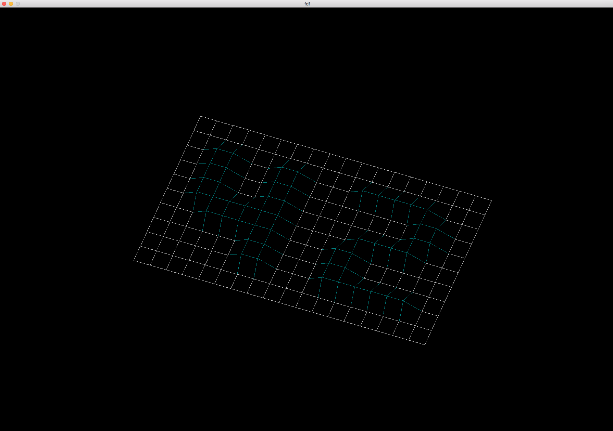
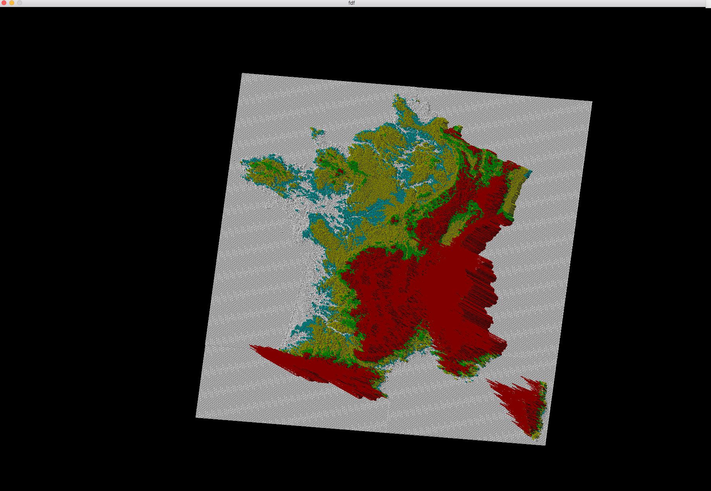

# Fdf-Wireframe


<br />
<br />
<br />


Fdf was created as a school project.

It consist to read a map, and to connect each points to form a [Topographical relief](https://en.wikipedia.org/wiki/Terrain).

### Prerequisites

All libraries are included.

## Installing

Clone :

```
git clone https://github.com/kmjaku/Fdf-Wireframe.git ~/Fdf
cd ~/Fdf
make
```

Launch Fdf :

```
you can replace 'example' by a test map which is included in the folder 'map'
./fdf map/[example.fdf]
```

Enjoy

### Clean

Clean your directory using availabe commands

Delete objet files :

```
cd ~/Fdf
make clean
```

Delete binaries and libraries :

```
cd ~/Fdf
make fclean
```

## Keyboard Shortcuts

The shortcuts are essential to navigate in the screen

### Camera Controls

- <kbd>&uarr;</kbd> / <kbd>&darr;</kbd> camera up / down
- <kbd>&larr;</kbd> / <kbd>&rarr;</kbd> camera left / right
- <kbd>1</kbd> / <kbd>2</kbd> rotate camera around Y-axis positive / negative
- <kbd>4</kbd> / <kbd>5</kbd> rotate camera around X-axis positive / negative
- <kbd>7</kbd> / <kbd>8</kbd> rotate camera around Z-axis positive / negative
- <kbd>esc</kbd> exit

## Contact & Copyright

Project done by [Kastriot MJAKU](https://www.linkedin.com/in/kastriot-mjaku-29b675a5/).
If you want to contact me, you can send me a mail at kmjaku@student.42.fr

### Aknowledgments

My thanks to the [42](http://www.42.fr/) school where I worked countless hours to finish this project.